# 멘티 유니온: 성장을 위한 커뮤니티

이 프로젝트는 개인이 기존 스프링 부트로 제작한 프로젝트를 Node진영의 NestJS 프레임워크로 변경하여 새로 구축하며, GPT를 이용해 가상의 팀을 편성하여 제작하는 실험적이면서 실 서비스까지 목표로하는 프로젝트입니다.

## 프로젝트 목표

- 멘티들이 서로 의지하며 성장할 수 있는 커뮤니티 구축
- 지식과 경험 공유를 통한 학습 촉진
- 멘티들의 상호작용을 통해 멘토 역량을 개발하고 인정받을 수 있는 시스템 마련

## 주요 기능

- 커뮤니티 포럼: 멘티들이 질문, 답변, 토론을 통해 정보를 공유할 수 있는 공간
- 세미나 및 워크샵: 멘티들이 자신의 지식을 공유하고, 서로 학습할 수 있는 온라인/오프라인 이벤트 개최
- 레벨링 시스템: 멘티들의 활동에 따라 포인트를 부여하고, 일정 레벨에 도달하면 멘토로 승격
- 멘토-멘티 매칭 시스템: 높은 레벨의 멘티(혹은 멘토)와 멘티 간의 1:1 멘토링 기회 제공
- 리소스 라이브러리: 유용한 자료, 가이드, 튜토리얼 등을 공유하는 자료실

## 커뮤니티 참여 방식

- 멘티 가입: 멘티로 가입하여 커뮤니티 활동 시작
- 활동 기반 포인트 제도: 포럼 참여, 세미나 주최, 자료 공유 등의 활동으로 포인트 획득
- 레벨 업 및 멘토 승격: 일정 포인트 도달 시 자동으로 레벨 업, 특정 레벨에서 멘토로 승격 가능

## 기술 스택

- 웹 프론트엔드: React, Vue.js 등을 활용한 사용자 친화적 인터페이스
- 백엔드: Node.js, Express.js 등 서버 사이드 로직 및 API 개발
- 데이터베이스: MongoDB, MySQL 등 커뮤니티 데이터 관리
- 클라우드 및 배포: AWS, Docker 등을 통한 서비스 호스팅 및 관리

## API 정의

- protocol: https
- host: api.menteeunion.kro.kr
- tls: ✅ (적용)
- type: reverse proxy
- base_path: api
- api_path: https://api.menteeunion.kro.kr/api

토큰 이용 API: `AUTH` 표기

### Users

> 유저 API

start_path: /users

| method   | uri                         | query | params   | body            | desc                         | auth |
| -------- | --------------------------- | ----- | -------- | --------------- | ---------------------------- | ---- |
| `GET`    | /                           |       |          |                 | 전체 조회                    |      |
| `GET`    | /:id                        |       | pk       |                 | 단건 조회                    |      |
| `GET`    | /profile                    |       |          |                 | 단건 조회                    | ✅   |
| `GET`    | /profile/seminars           |       |          |                 | 유저 세미나 정보 조회        | ✅   |
| `GET`    | /profile/forums             |       |          |                 | 유저 포럼 정보 조회          | ✅   |
| `GET`    | /profile/points             |       |          |                 | 유저 포인트 시스템 정보 조회 | ✅   |
| `GET`    | /profile/resource/:filename |       | filename |                 | 유저 프로필 이미지 조회      | ✅   |
| `GET`    | /socket/profile             |       |          |                 | 소켓서버 프로필 조회         | ✅   |
| `POST`   | /                           |       |          | user table 참조 | 회원가입                     | ✅   |
| `POST`   | /points/already             |       |          |                 | 이미 추천했는지 여부         | ✅   |
| `POST`   | /user-points                |       |          |                 | 특정 사용자 추천             | ✅   |
| `POST`   | /check/email                |       |          |                 | 이메일 중복 검증             | ✅   |
| `POST`   | /check/username             |       |          |                 | 유저네임 중복 검증           | ✅   |
| `PUT`    | /:id                        |       | pk       |                 | 회원정보 수정                | ✅   |
| `PUT`    | /profile                    |       | pk       |                 | 회원 프로필 이미지 수정      | ✅   |
| `DELETE` | /:id                        |       | pk       |                 | 회원탈퇴                     | ✅   |
| `DELETE` | /dormant                    |       | pk       |                 | 회원탈퇴 취소                | ✅   |

### Seminars

> 세미나 API

start_path: /seminars

| method   | uri           | query | params | body | desc               | auth |
| -------- | ------------- | ----- | ------ | ---- | ------------------ | ---- |
| `GET`    | /             |       |        |      | 전체 조회          |      |
| `GET`    | /:id          |       | pk     |      | 단건 조회          |      |
| `GET`    | /participants |       |        |      | 참여자 조회        | ✅   |
| `POST`   | /             |       |        |      | 생성               | ✅   |
| `POST`   | /join         |       |        |      | 참여               | ✅   |
| `POST`   | /confirm      |       |        |      | 참여 확정          | ✅   |
| `POST`   | /upload       |       |        |      | 커버 이미지 업로드 | ✅   |
| `PUT`    | /:id          |       | pk     |      | 수정               | ✅   |
| `DELETE` | /:id          |       | pk     |      | 삭제               | ✅   |
| `DELETE` | /cancel       |       |        |      | 참여 취소          | ✅   |

### Forums

> 포럼 API

start_path: /forums

| method   | uri     | query | params | body | desc         | auth |
| -------- | ------- | ----- | ------ | ---- | ------------ | ---- |
| `GET`    | /       |       |        |      | 전체 조회    |      |
| `GET`    | /:id    |       | pk     |      | 단건 조회    |      |
| `POST`   | /       |       |        |      | 생성         | ✅   |
| `POST`   | /revert |       |        |      | 삭제 건 복구 | ✅   |
| `PUT`    | /:id    |       | pk     |      | 수정         | ✅   |
| `DELETE` | /:id    |       | pk     |      | 삭제         | ✅   |

### Grade

> 등급 API

start_path: /grade

| method   | uri  | query | params | body | desc      | auth |
| -------- | ---- | ----- | ------ | ---- | --------- | ---- |
| `GET`    | /    |       |        |      | 전체 조회 |      |
| `GET`    | /:id |       | pk     |      | 단건 조회 |      |
| `POST`   | /    |       |        |      | 생성      | ✅   |
| `PUT`    | /:id |       | pk     |      | 수정      | ✅   |
| `DELETE` | /:id |       | pk     |      | 삭제      | ✅   |

### Mentoring

> 멘토링 API

start_path: /mentoring

| method   | uri                                    | query | params              | body | desc                    | auth |
| -------- | -------------------------------------- | ----- | ------------------- | ---- | ----------------------- | ---- |
| `GET`    | /                                      |       |                     |      | 전체 조회               |      |
| `GET`    | /users                                 |       | pk                  |      | 소켓에서 프로필 조회    | ✅   |
| `GET`    | /:id                                   |       | pk                  |      | 단건 조회               |      |
| `POST`   | /                                      |       |                     |      | 생성                    | ✅   |
| `POST`   | /revert                                |       |                     |      | 삭제 건 복구            | ✅   |
| `PUT`    | /:id                                   |       | pk                  |      | 수정                    | ✅   |
| `DELETE` | /:id                                   |       | pk                  |      | 삭제                    | ✅   |
| `DELETE` | /session/:session_id/mentee/:mentee_id |       | session_pk, user_pk |      | 세션에 속한 멘토링 삭제 | ✅   |

### Mailer

> 메일링 API

start_path: /mailer

| method | uri             | query                             | params | body | desc                               | auth |
| ------ | --------------- | --------------------------------- | ------ | ---- | ---------------------------------- | ---- |
| `GET`  | /confirm        | email                             |        |      | 사용자 이메일로 인증 메일 전송     |      |
| `GET`  | /reset-redirect | tkn:토큰, e:이메일, type:검증유형 |        |      | 토큰 및 이메일 검증 후 리디렉션    |      |
| `GET`  | /check          | q:암호화된 쿼리                   |        |      | 메일 토큰 검증 후 결과 페이지 응답 |      |

### Auth

> 인가 API

start_path: /auth

| method | uri      | query | params | body            | desc                    | auth |
| ------ | -------- | ----- | ------ | --------------- | ----------------------- | ---- |
| `GET`  | /profile |       |        |                 | 유저 프로필 데이터 조회 | ✅   |
| `POST` | /signin  |       |        | email, password | 로그인                  |      |
| `POST` | /signout |       |        |                 | 로그아웃 처리           | ✅   |

### Mentoring Session

> 멘토링 세션 API

start_path: /mentoring-session

| method   | uri             | query | params | body | desc                                                             | auth |
| -------- | --------------- | ----- | ------ | ---- | ---------------------------------------------------------------- | ---- |
| `GET`    | /               |       |        |      | 전체 조회                                                        |      |
| `GET`    | /:id            |       |        |      | 단건 조회                                                        | ✅   |
| `GET`    | /session/:id    |       |        |      | 단건 조회 (소켓)                                                 | ✅   |
| `GET`    | /users          |       |        |      | 유저가 속한 세션의 멘토링 전체 조회 (소켓)                       | ✅   |
| `GET`    | /users/not-read |       |        |      | 유저가 속한 세션의 해당 유저가 읽지 않은 메세지 모두 조회 (소켓) | ✅   |
| `POST`   | /               |       |        |      | 세션 생성                                                        | ✅   |
| `PUT`    | /:id            |       |        |      | 세션 수정                                                        | ✅   |
| `DELETE` | /:id            |       |        |      | 세션 삭제                                                        | ✅   |

#### NestJS Gateway subscribe messages

socket.io path: /channel

| message                                | body                   | auth | response                          | desc                         |
| -------------------------------------- | ---------------------- | ---- | --------------------------------- | ---------------------------- |
| initialize                             |                        | ✅   | sessionList, userData, nowSession | 연결 초기화                  |
| createSession                          | mentoring session dto  | ✅   | nowSession                        | 세션 생성                    |
| joinSession                            | session_id             | ✅   | nowSession                        | 세션 참여                    |
| compareSessionWithPassword             | session_id, password   | ✅   | hashed password                   | 비공개 세션 비밀번호 검증    |
| outSession                             | session_id             | ✅   |
| updateSession, sessionList, nowSession | 세션 나가기            |
| waitlist                               | session_id             | ✅   | updateSession, nowSession         | 세션에서 대기열로 이동       |
| changeSession                          | session_id             | ✅   | updateSession, nowSession         | 세션 이동, 유저 상태 값 변경 |
| saveMessage                            | session_id, message    | ✅   | updateSession                     | 세션 범위 메세지 전송        |
| deleteMessage                          | session_id, message_id | ✅   | updateSession                     | 세션 범위 메세지 삭제        |

#### 세션 플로우차트

```mermaid
sequenceDiagram
  autonumber

  actor C as Client
  participant M as MentoringPage

  note right of C: 페이지 이동
  C ->> M: in page
  note right of M: 소켓 연결
  create participant G as Gateway
  M ->> G: socket connection
  rect rgb(5, 5, 5)
    note over M,G: [[initialize]]
    %% initialize
    M -->> +G: 세션 및 유저 데이터 요청
    note right of M: client.emit("initialize")
    create participant DB as Database
    G -->> +DB: 세션 찾기
    DB -->> G: 세션 리스트
    alt 토큰 검증 통과
      note left of G: 룸 연결 초기화
      G -->> M: 유저의 멘토링 상태 초기화
      note left of G: 초기 데이터 응답
      G -->> M: 세션 리스트 응답
      note left of G: server.emit("updateSessionList")
      G -->> -M: 유저 토큰 데이터
      note left of G: server.emit("updateUserData")
    else 토큰 검증 실패
      G -->> M: WsException
    end
    G -> M: 완료
  end
  rect rgb(5, 5, 5)
    note over M,G: [[createSession]]
    %% createSession
    M ->> +G: 방 생성 요청
    note right of M: client.emit("createSession")
    note right of M: topic, objective, format, limit, category, note
    note left of G: 세션 생성
    G -->> +DB: 세션 생성
    note left of G: 멘토링 생성
    G -->> DB: 멘토링 생성
    note left of G: 멘토링 status 변경 (enter)
    G -->> DB: 멘토링 status -> "enter"
    G -->> M: 세션 리스트 응답
    G -->> DB: 멘토링 생성
    G -->> DB: 세션 단일 조회
    DB -->> -G: 세션 단건
    G ->> -M: 세션 응답
    note left of G: server.emit("updateSession")
    G -> M: 완료
  end
  rect rgb(5, 5, 5)
    note over M,G: [[changeCurrentSession]]
    note right of M: client.emit('join', { session_id })
    %% enter session
    M ->> +G: 방 입장 요청
    note left of G: 제한인원 확인
    alt 방에 이미 참여 했을 시
    M -->> G: 멘토링 상태 변경
    note left of G: 멘토링 status 변경 (enter)
    G -->> M: 변경한 세션 응답 (broadcast)
    else 방에 참여하지 않았을 시
    note left of G: 멘토링 생성 (enter)
    note left of G: server.to("room").emit("updateSession", session)

    else 인원 초과
    G -> M: 끝(입장 거절)
    end
    note left of G: 세션 찾기
    note left of G: 세션에 속한 멘토링 찾기
    note left of G: 멘토링 찾아서 status 변경 (enter)
    G -->> -M: 세션 리스트 및 입장 세션 응답
  end
```

